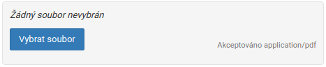

## Introduction

Dynamic forms are libraries, which provides an option for definition form inputs and you can generate with them a dynamic form. This
dynamic form libraries are used by View Module and [Universal Modules](../modules/universal-modules.md) in a current time.

## Implementation

All form inputs libraries are represented under the `App\Structures\FormFields` namespace. In all of these types, you can
use the `make` method, which returns a new instance of the specific input and it's a good way for better chaining implementation.
The majority of methods of these form inputs, they return `$this` pointer, what means that you can almost all of these methods use 
for the chaining.

### TextInput

This form type generates `<input type="text">`.

```php
<?php
\App\Structures\FormFields\TextInput::make('input_name', 'Input label')
    ->required()                            // optional: mandatory field
    ->value('Default value')                // optional: default value
    ->maxLength(100)                        // optional: maximal length of text
    ->placeholder('Enter some input..');    // optional: placeholder
```

### NumberInput

This form type generates `<input type="number">`.

```php
<?php
\App\Structures\FormFields\NumberInput::make('input_name', 'Input label')
    ->required()                            // optional: mandatory field
    ->value(10)                             // optional: default value
    ->min(0)                                // optional: minimal possible number
    ->max(100)                              // optional: maximal possible number
    ->step(5)                               // optional: change in steps
    ->placeholder('Enter some number...');  // optional: placeholder
```

### Select

This form type generates `<select>`.

```php
<?php
\App\Structures\FormFields\Select::make('input_name', 'Input label')
    ->required()                            // optional: mandatory field
    ->options([                             // optional: options
        1 => 'Option 1',
        2 => 'Option 2',
        'A' => 'Option A',
    ])
    ->value(2)                              // optional: default value
    ->multiple();                           // optional: multiple selecting
```

### TextArea

This form type generates `<textarea>`.

```php
<?php
\App\Structures\FormFields\TextArea::make('input_name', 'Input label')
    ->required()                            // optional: mandatory field
    ->value('Some long text...')            // optional: default value
    ->maxLength(500)                        // optional: maximal length of text
    ->rows(8)                               // optional: count of rows
    ->placeholder('Enter some text...');    // optional: placeholder
```

### CKEditor

This form type generates `<textarea>` with initializing CKEditor on it.

```php
<?php
\App\Structures\FormFields\CKEditor::make('input_name', 'Input label')
    ->required()                                        // optional: mandatory field
    ->value('<p>Hello <strong>WORLD</strong></p>');     // optional: default value
```

### Image

This form type generates an image selector for [Media Library](media-library.md).


```php
<?php
\App\Structures\FormFields\Image::make('image_name', 'Image label')
    ->required();           // optional: image is mandatory
```

### Media File

This form type generates a file selector for [Media Library](media-library.md).



```php
<?php
\App\Structures\FormFields\MediaFile::make('file_name', 'File label')
    ->required()                        // optional: file is mandatory
    ->acceptedType('application/pdf');  // optional: file must be in PDF format
```

### Checkbox

This form type generates a classic checkbox input `<input type="checkbox"`. This classic checkbox always returns a boolean value.


```php
<?php
\App\Structures\FormFields\Checkbox::make('checkbox_name', 'Checkbox label')
    ->value(true);      // optional: checkbox field will be checked
```

### Checkbox Switch

This form type generates a classic checkbox input with a switching style. This classic checkbox in a switching style always returns a boolean value.


```php
<?php
\App\Structures\FormFields\CheckboxSwitch::make('checkbox_name', 'Checkbox label')
    ->value(true);      // optional: checkbox field will be checked
```

### Input

This form type generates the `<input>` element with a given type.

```php
<?php
\App\Structures\FormFields\Input::make('date', 'input_name', 'Input label')
    ->required()                                       // optional: mandatory field
    ->value(\Carbon\Carbon::today()->toDateString());  // optional: default value
```

## Localization

If you want to use a localization for your input fields, you can use a translation key directly:

```php
<?php
\App\Structures\FormFields\TextInput::make('input_name', 'theme::universal_modules.questions.labels.name')
    ->required();
```

When a system will find this translation key, then it will be used a corresponding translation. If not, then a system
will use this translation key only.