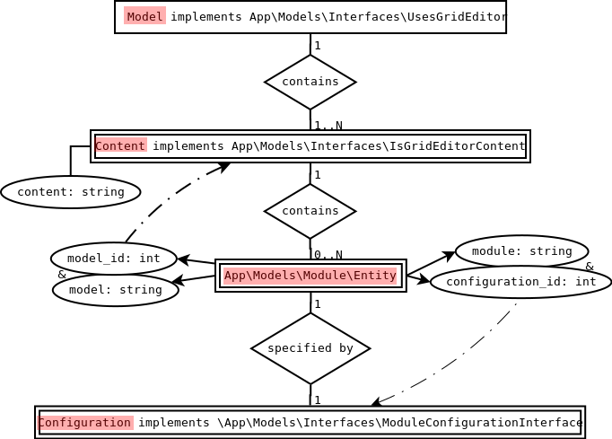
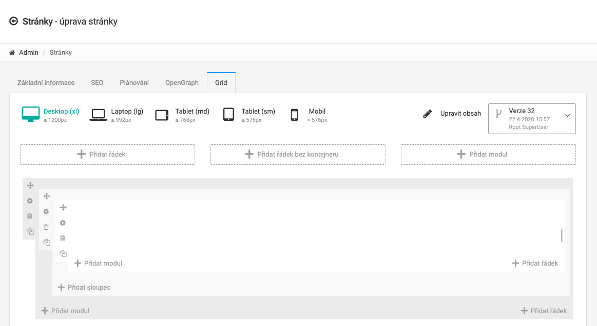
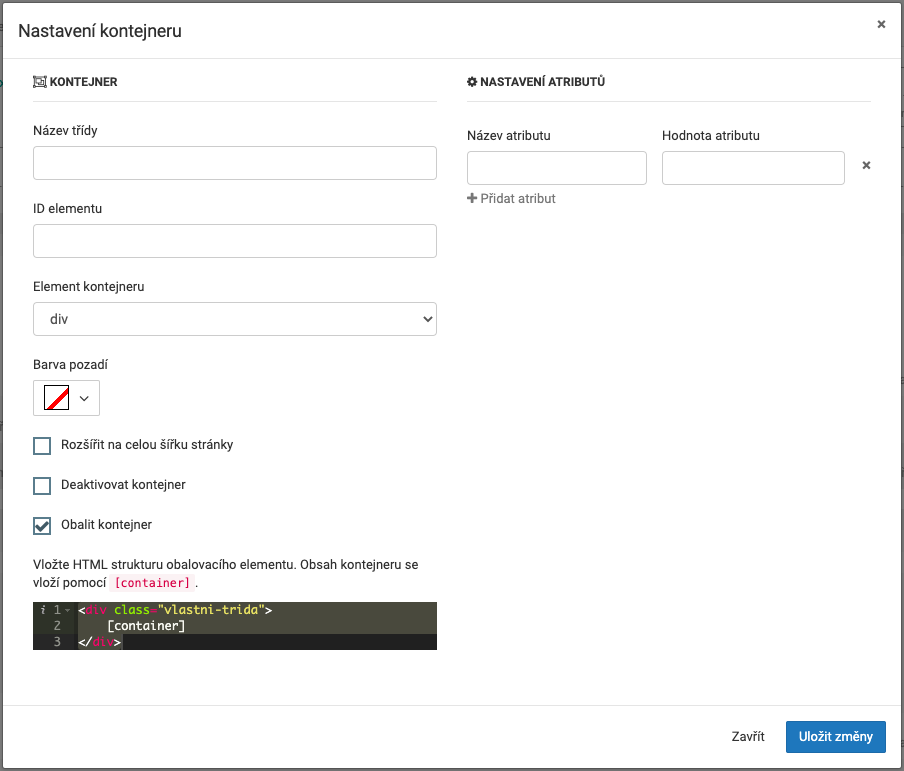
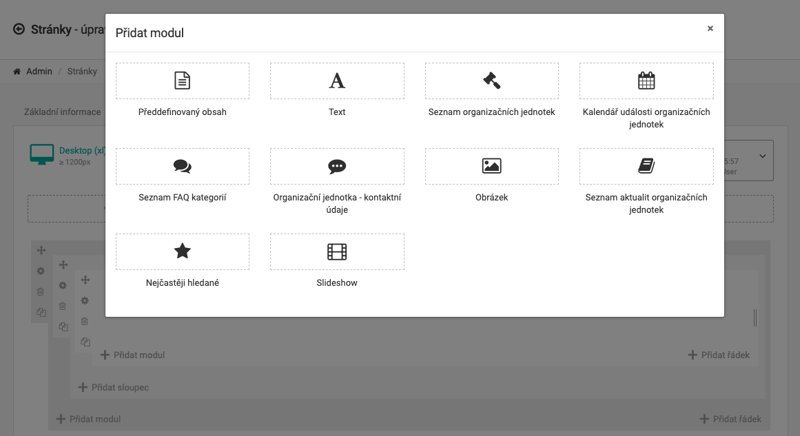

## Introduction

The Grid Editor is a feature, which offers for common users (administrators) a good way how they can modify a 
content of some page, and for developers as well. It's really simple to use it. And now we will describe all options below.

> The Grid Editor **uses Bootstrap Layout CSS** in the resulting HTML.

## Hierarchy

Hierarchy of Grid Editor has four levels. The first two levels must be implemented for each use separately, but another two levels
are using for all uses in general.

The first level represents a model which uses Grid Editor (for example `App\Models\Page\Page`). The second level is a content of Grid Editor for this model.
Each content can be versioned (ex. for pages) or just only specified for a language (ex. for widgets). The third level represents
entities. The entity is just like a bridge between a content inside Grid Editor and a specific module designed for Grid Editor. Inside the entity, a system
is storing an information about a content placement in Grid Editor, a specific module and a specific configuration of this content as well.
The last (fourth) level is a configuration model, which keeps implemented configurations and belongs to a specific entity item.

## How To Use Grid Editor

By default, you can find the Grid Editor in administration of pages (under the "Grid" tab). Look in the image below:

First, there is a panel with options for specific devices. It means that you can define the layout separately for more devices according to their width.

> **IMPORTANT** If you want to define the layout for specific devices, **remember**, that there is not working any inheritance! 

On the right side, there is one button for change a current display mode. You can wish to edit a template completely (including rows, cols, etc.) or
just only a content. With this display mode button, you can also see a select list. It's completely history about all changes that have taken place in the past. If you made changes what
you want to get back, there is nothing easier that selecting older content from this list.

### Define A Layout

Under the devices panel, there are main components for making a layout grid. You can add a row with a container, a row without a container or just choose a module.
When **you will choose a "Row with a container"**, you can see the following grid:

In your new row with a container, you can see three grid components - a container, a row and a column. Each of them offers you a few settings, which we will describe on the 
following rows.

#### Container 

When you will click on setting icon of the container grid component, there will be possible to set a few options - mainly a class name, element id or
a container element (you can change a default `
` element to semantic one - for example `<article>`). Everything you need to change, it's free for you.

When you will necessary need to wrap this container, it's possible to do it using checkbox "Wrap the container". After checked this, it will appear a small box under the checkbox.
Here open for you an option where you can write directly the source code. **Be attention** that it's not **place for inserting any special source code**! This block serves you just only for write a wrapper
where inside this wrapper will be defined the `[container]` wildcard.

> **Do not forget** that for correct rendering of a wrapper you must use the `[container]` **wildcard**.

#### Row

After clicking on setting icon of the row grid component, there will appear very similar options like for the container except of a wrapper (it's not needed for a row) - the main 
settings are the following few options: a class name, element id and a row element as well. Another options are not so interesting but if you need them, then you can use it.

#### Column

When you check the column grid component, here will not be anything else compare with the row component above. Just for summary, here are the three main settings: a class name,
element id and a column element as well. Everything you need to change, you are free to do it right here.

### Another Layouts

Except of the "Row with container" option described above, **you can choose another two options: "Row without container" and "Module"**. The "Row without container" is almost the same like
the previous option, but without a container as a wrapper for the row. It means that all information above are valid for this option as well.

The option "Module" offers you to insert a module, which is defined as **"For Grid Editor"** type.

> If you want to know **how you can make your custom "For Grid Editor" module**, try to visit [Modules/For Grid Editor](../modules/for-grid-editor.md).