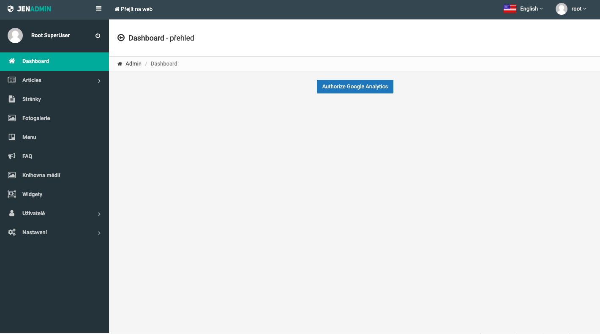
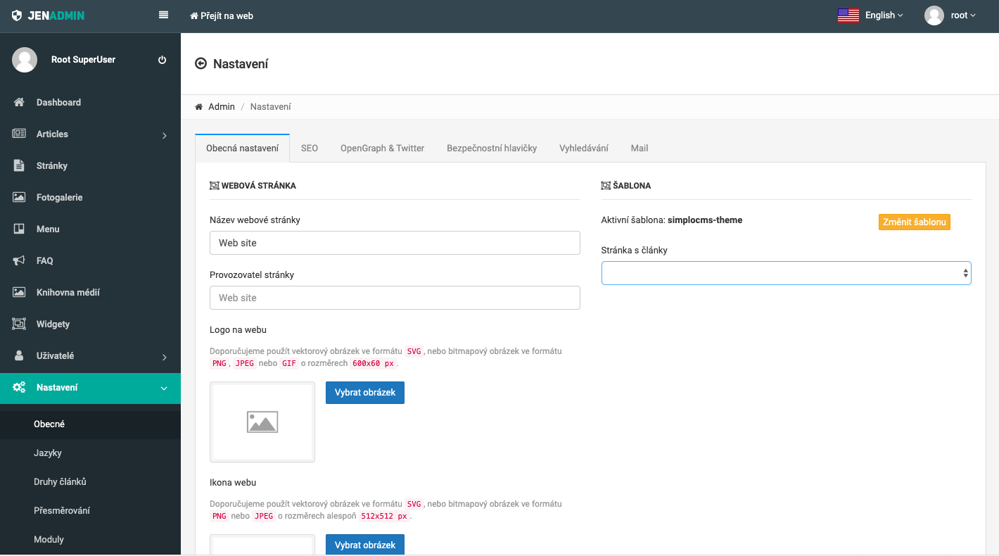
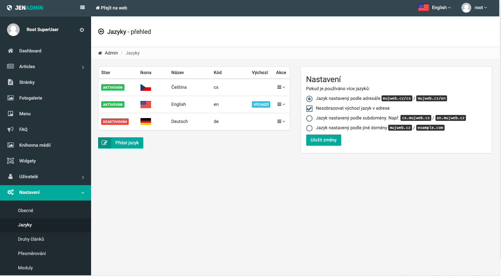
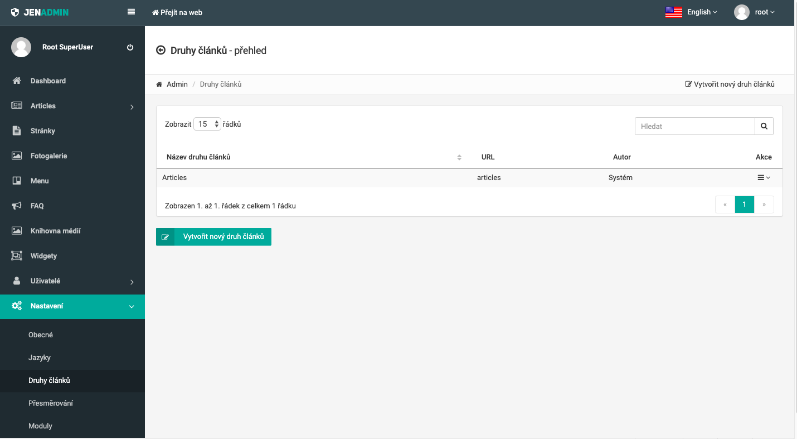
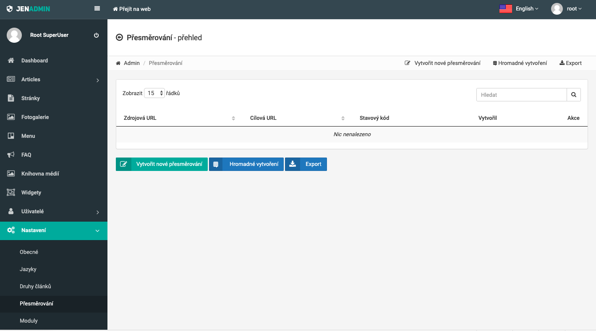
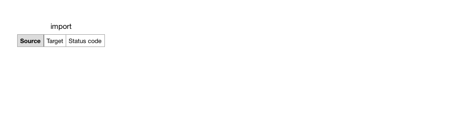

## Introduction

The SIMPLO CMS has many configuration options, which offers you a lot of flexibility and another functionalities. 
As a developer, you can set them using [environment configuration](https://laravel.com/docs/5.8/configuration#environment-configuration) 
with your `.env` file, define new configuration or rewrite default configuration from `config` directory in your theme project. 
Except of these possibilities, you can easily make some changes directly in SIMPLO CMS administration panel, what is very 
comfortable, effective and easy.

> For more information about **Configuration**, you can visit [Configuration](getting-started/configuration.md) page.

## Administration Panel

How it was mensioned in the introduction, you can also set some options using administration panel, which you can visit 
on default page - `your-page.com/admin`.

> **After first installation of SIMPLO CMS**, the default admin credentials are following:   
Username: **root**  
Password: **RootUser1**

*Administration Panel*

> **TODO** We need to solve localization of administration in SIMPLO CMS !!!

### Main Settings

#### General

For check actual settings, you can visit "Settings > General". In the first "General settings" tab, you can set website name, operator, logo, 
icon, background of the icon and also change your active template.

If you will change your actual active template, then in "Template" section there will appear additional settings belonging to 
this active template. For Example template, you can see additional settings in the image below:

For Example template, it's one additional setting called "Page with articles" serving for setting specific view for rendering 
articles.

#### SEO

The second tab is "SEO" and offers settings for default title and description. In SEO title, you can use variables `%itle%` and
`%site_name%`. When you use them here, on website `%title%` will be replaced with actual title page, what user visits. Variable
`%site_name%` will be replaced in every time with website name, what is the same for the whole web.

#### OpenGraph & Twitter

The third tab, which you can notice, is "OpenGraph & Twitter". How the name of this tab reveals, here it's possible to set something 
for OpenGraph and Twitter. In the first input, it's place for setting user name to your Twitter account and you have to adduce including
`@`. In the second input, it's convenient place for setting og:title, og:description and og:image. Of course, it's also possible to use
`%title%` and `%site_name%` variables for og:title like in SEO title.

#### Security Headers

The next tab is "Security Headers" and it's place for settings headers - X-Frame-Options, X-Xss-Protection, Refferer-Policy, 
X-Content-Type-Options or HTTP Strict Transport Security. Everything what you set, you can also check on 
[securityheaders.com](https://securityheaders.com/).

#### Searching

The "Searching" tab serves for a few setting options related with searching on your website. It's possible to set url slug, where
visitors can find search page, or allow following features:
- search on website
- search in all pages
- search in all articles
- search in all categories
- search in all photogalleries

#### Mail

The last tab is "Mail" and provides settings about e-mail. It's possible to find here settings about sender email, 
sender name and also the method for sending emails on your website. Set the method for sending emails, developers can choose
either SENDMAIL or SMTP. 

The SENDMAIL method uses PHP sendmail() function and sends emails using local server's configuration
with a few limits. 

For sending emails using SMTP, you can choose SMTP choice. When you chose the SMTP method, it will shows 
additional settings for set SMTP address, SMTP port, SMTP crypt protocol and also check button for turn on / off SMTP
authorization. If you will turn on this authorization, then you will see inputs for filling in SMTP username and password.
If you set everything how you need, then you can test correct setting in section "Send Test Email" on the same setting page.
Just only fill in email, where will be send test email, and click on "Send Test Email" button. After this action, please check
this email, if you receive test email from your website. If you didn't receive this test email, then probably your email
settings are incorrect and you have to fix.

> **IMPORTANT!** If you will try to set email directly in Laravel (for example using [Environment Configuration](https://laravel.com/docs/5.8/configuration#environment-configuration)),
it will not works properly. In SIMPLO CMS, it's possible to set email **only** through **Administration Panel**.

### Language Settings

In Administration Panel, you can also set simply languages. By default, SIMPLO CMS offers three languages - Czech, English and German.

But if this default language's list is not convenient in your mind, you are free to add a new language using "Add language" button. On this
page, you will see inputs for following settings, what you need to set:

- language name (ex. English)
- country code (ex. eng)
- language code (ex. en)
- language domain (en.your-page.com)
- activate check button

In the second column box, there is additional setting about languages, when you use more than only one of them. In this case,
it's convenient place for setting of identification way for language in URL address. You can choose following identification by:

- the folder structure (ex. your-page.com/en)
- the sub-domain (ex. en.your-page.com)
- the different domain (ex. your-english-page.com / your-german-page.com)

> When you choose language's identification by the folder structure, it's possible to hide the language's folder name from URL address
for your **default language**. It means, that if your default language is English, you can have clean URL address only like your-page.com.

### Article Types

On this setting page, it's ideal way to add new types for articles.

For adding new article type, you have possibility to fill in following information about your new article type:

- name 
- URL slug
- description
- allow using tags
- allow using GridEditor - TODO: add internal link to Grid Editor
- show article category in URL and breadcrumb navigation of the articles

> Including the settings above, you are free to set also SEO and OpenGraph for your new article type.

### Redirection

It's setting page, where you can add new redirect URL addresses.

 
If you want to add only one URL address, click on "Add new redirection" button. After this step, you will see the form for 
creating one redirection with following settings:

- source URL address
- target URL address
- status code (ex. 301 - Moved Permanently)

For multiple creating redirection, you can click on "Multiple creating" button, where it's possible to create simply
multiple URL addresses for redirection using "Add row" link in one step. On Multiple Creating Redirection page except of 
multiple creating, you have also the opportunity for importing redirects with CVS import. The CSV file for this import must have
format the same like in the screenshot below:

All of your redirects you can also export to the CSV file. It's simple way when you need to copy or move your redirects between
applications.

### Modules

It's setting page, where you can manipulate in SIMPLO CMS Modules. The modules are a very effective way, how SIMPLO CMS
can be extended about some new great features.

How you can notice in the screenshot above, SIMPLO CMS serves a few useful modules after its installing.

> If you know more about **Modules**, how you can use them, install new modules or how it's possible to create new module, please
visit [Modules](modules/general.md).